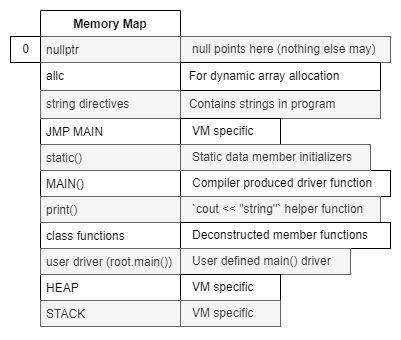
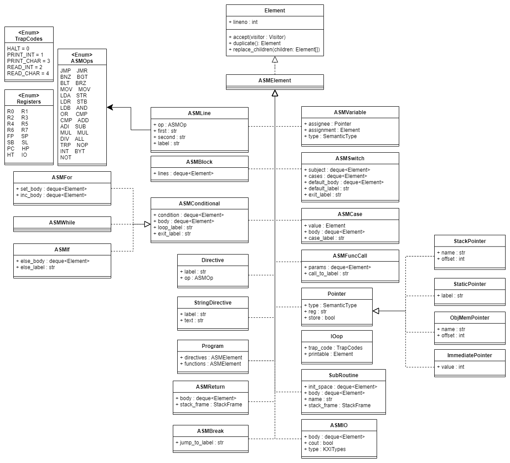
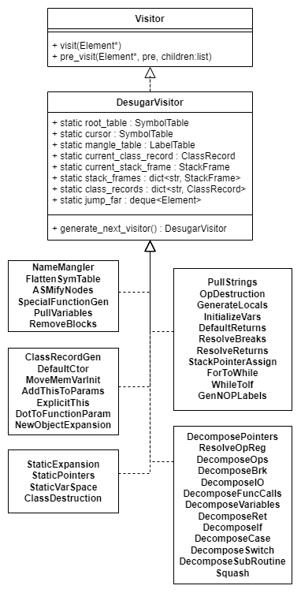
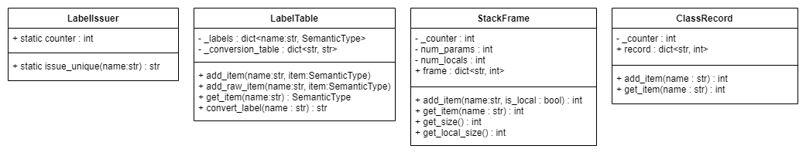

# KXI Compiler
Using Python and SLY
## Lexer
### Lexical Specification
#### Abbreviations
<code><pre>
alpha          ::= [A-Za-z]
digit          ::= [0-9]
end_line       ::= [\r\n]+
unescaped_char ::= ASCII 32-126 except `"`, `'`, and `\`
escaped_char   ::= \\[\rtn]
char           ::= \<unescaped_char> | \<escaped_char></pre></code>

#### Keywords
`bool` `break` `case` `class` `char` `cin` `cout` `default` `else` `false` `for` `if` `int` `new` `null` `public` `private` `return` `static` `string` `switch` `this` `true` `void` `while`

#### Punctuation
`;` `{` `}` `(` `)` `[` `]` `,` `:`  

#### Operators
`=` `==` `!=` `>=` `<=` `>` `<` `&&` `||` `!` `+` `-` `*` `/` `+=` `-=` `*=` `/=` `<<` `>>` `.` 

#### Other 
<code><pre>
identifier ::= (\<alpha> | _) (\<alpha> | \<digit> | _)*
char_lit   ::= '(\<char> | \\' | ")'
string_lit ::= "(\<char> | \\" | ')\*"
int_lit    ::= \<digit>+
comment    ::= // .\*(.\*|[\<end_line>]*)
unknown    ::= .
box        ::= `[` `]`</pre></code>

#### Corresponding Tags
- Keywords: Same letters but capitalized
- Punctuation: `SEMICOLON` `LCURLY` `RCURLY` `LSQUARE` `RSQUARE` `LPAREN` `RPAREN` `DOT` `COMMA`
- Operators: `EQ` `EQEQ` `NOTEQ` `GEQ` `LEQ` `GT` `LT` `AND` `OR` `NOT` `PLUS` `MINUS` `TIMES` `DIVIDE` `PLUSEQ` `MINUSEQ` `TIMESEQ` `DIVIDEEQ` `INSERT` `EXTRACT`
- Other: `ID` `CHARLIT` `STRINGLIT` `INTLIT` `UNKNOWN` `BOX`

#### SLY implementation
- KXILexer is a subclass of sly.Lexer  
- There is no COMMENT tag. This project uses SLY to ignore all comments. (Same regex is used, but a COMMENT Token will not appear in Token Stream)  

## Parser
### Grammar
<pre><code>CompilationUnit       ::= &ltClassDefinition>* void main `(` `)` &ltBlock>  
ClassDefinition       ::= class &ltidentifier> `{` &ltClassMemberDefinition>* `}`  
ScalarType            ::= void | int | char | bool | string | &ltidentifier>  
ConstructedType       ::= &ltScalarType> (`[` `]`)*  
Modifier              ::= public | private  
ClassMemberDefinition ::= &ltMethodDeclaration> | &ltDataMemberDeclaration> | &ltConstructorDeclaration>  
DataMemberDeclaration ::= static? &ltModifier> &ltVariableDeclaration>  
MethodDeclaration     ::= static? &ltModifier> &ltConstructedType> &ltMethodSuffix>  
ConstructorDeclaration::= &ltMethodSuffix>  
MethodSuffix          ::= &ltidentifier> `(` &ltParameterList>? `)` &ltBlock>  
ParameterList         ::= &ltParameter> (, &ltParameter>)*  
Parameter             ::= &ltConstructedType> &ltidentifier>  
VariableDeclaration   ::= &ltConstructedType> &ltidentifier> &ltInitializer>? ;  
Initializer           ::= `=` &ltExpression>  
Statement             ::= if `(` &ltExpression> `)` &ltStatement>
                        | if `(` &ltExpression> `)` &ltElseStatement> else &ltElseStatement>
                        | while `(` &ltExpression> `)` &ltStatement>  
                        | for `(` &ltExpression>? ; &ltExpression> ; &ltExpression>? `)` &ltStatement>  
                        | return &ltExpression>? ;  
                        | cout << &ltExpression> ;  
                        | cin >> &ltExpression> ;  
                        | switch `(` &ltExpression> `)` &ltCaseBlock>  
                        | break ;  
                        | &ltExpression> ;  
                        | &ltBlock>  
                        | &ltVariableDeclaration> 
ElseStatement         ::= if `(` &ltExpression> `)` &ltElseStatement> else &ltElseStatement>
                        | while `(` &ltExpression> `)` &ltElseStatement>  
                        | for `(` &ltExpression>? ; &ltExpression> ; &ltExpression>? `)` &ltElseStatement>  
                        | return &ltExpression>? ;  
                        | cout << &ltExpression> ;  
                        | cin >> &ltExpression> ;  
                        | switch `(` &ltExpression> `)` &ltCaseBlock>  
                        | break ;  
                        | &ltExpression> ;  
                        | &ltBlock>  
                        | &ltVariableDeclaration>  
Block                 ::= { &ltStatement>* }  
CaseBlock             ::= { &ltCase>* default : &ltStatement>* }  
Case                  ::= case (&ltint_lit> | &ltchar_lit>) : &ltStatement>*  
Expression            ::= &ltExpression> =  &ltExpression>  
                        | &ltExpression> += &ltExpression>
                        | &ltExpression> -= &ltExpression>  
                        | &ltExpression> *= &ltExpression>  
                        | &ltExpression> /= &ltExpression>  
                        | &ltExpression> +  &ltExpression>  
                        | &ltExpression> -  &ltExpression>  
                        | &ltExpression> *  &ltExpression>  
                        | &ltExpression> /  &ltExpression>  
                        | &ltExpression> == &ltExpression>  
                        | &ltExpression> != &ltExpression>  
                        | &ltExpression> <  &ltExpression>  
                        | &ltExpression> >  &ltExpression>  
                        | &ltExpression> <= &ltExpression>  
                        | &ltExpression> >= &ltExpression>  
                        | &ltExpression> && &ltExpression>  
                        | &ltExpression> || &ltExpression>  
                        | ! &ltExpression>  
                        | + &ltExpression>  
                        | - &ltExpression>  
                        | `(` &ltExpression> `)`  
                        | &ltint_lit>  
                        | &ltchar_lit>  
                        | &ltstring_lit>  
                        | true  
                        | false  
                        | null  
                        | this  
                        | &ltidentifier>  
                        | new &ltConstructedType> ( &ltArguments> | &ltIndexer> )  
                        | &ltExpression> . &ltidentifier>  
                        | &ltExpression> &ltIndexer>  
                        | &ltExpression> &ltArguments>  
Arguments             ::= `(` &ltArgumentList>? `)`  
ArgumentList          ::= &ltExpression> (, &ltExpression>)*  
Indexer               ::= `[` &ltExpression> `]`  </code></pre>

#### Grammar with respect to Tokens
For the most part, it is fairly easy to see which tokens will be used by the grammar. There is one exception:  
- `ConstructedType ::= <ScalarType> ('[' ']')*`
  - The `'[' ']'` is represented by the `BOX` token to handle a reduce/reduce conflict

#### Sly implementation
KXIParser is a subclass of sly.Parser  
Grammar rules are written in CamelCase. To conform with Python programming standards, all grammar rules were converted to snake_case.

## AST
  
Note that `+visit(Element*)` is shorthand for: `+visit(CompUnit)`, `+visit(ClassDefinition)`, `...`

### Displaying Generated AST
Using the Visitor Pattern as implied by the AST UML, a DotGenerator visitor is used to generate a string compatible with the DOT language. A PNG will be generated when using option `-p` if `dot` is accessable via system PATH.

#### UML
  

## Semantics
### Approach
There are 4 steps to checking the Semantics (each as visitors).  
1: Generate Symbol Table (SymbolTableGenerator)  
2: Type check everything (CheckTypes)  
3: Check valid assignment (CheckAssignment)  
4: Check break statements (CheckBreaks)  

### Descriptions of visitors
| Area/Violation                                      | Visitor handling that rule |
| ---                                                 | --- |
| generates scope                                     | SymbolTableGenerator |
| duplicate members (same scope)                      | " |
| no shadowing class names (ever)                     | CheckTypes |
| no returning/passing functions                      | " |
| no assigning/comparing functions                    | " |
| new object expression points to constructor         | " |
| private/public access                               | " |
| static access in objects directly/this/implicitly   | " |
| static access out of object directly only           | " |
| object element access                               | " |
| type checked expressions                            | " |
| branching conditions are boolean                    | " |
| switch blocks consistent (only int and char)        | " |
| variable initializers consistent                    | " |
| return types consistent                             | " |
| valid assignment                                    | CheckAssignment |
| valid break placement                               | CheckBreaks |  
  
Introduced Types:  
- Array  
- Functions  
- Objects  

Notes:  
- Reference types: strings, objects, arrays (only these can be assigned null)  
- Constructor returns are void  
- Arithmetic operations only allow integer types  
- Boolean operations only allow boolean types  
- Relational operations only allow integer and character types  
- Equality/non-arithmetic-assignment operations any types (minus function types)  
- +\<char> => \<int>  
- cin/cout only deal with integers and chars

### Symbol Table output format 
<pre><code>Table format:
  &lttable full name>
  ----------------
  (+/-) &ltchild name>:{~}&ltchild type> { | -> &ltlink full name> }
  ...
  
Example of Class A with ctor, private method x, and static public data member y
  root.A
  ------
  + &ltinit>: f()->void | -> root.A.&ltinit>
  - x: f()->int[] | -> root.A.x
  + y: ~char
</code></pre>
Notes:  
- All symbol tables are linked to the `root` table in one way (just like a standard file system)
- `~` indicates static
  - This can indicate a static member
  - This can also mean the variable is a static reference to an object
- `-` indicates private
- `+` indicates public
- Functions take format: `f(<param>, <param>, ...)-><return>`
- Objects take format: `class <name>`

### UML
  

#### UML Notes
SymbolNode, SingleSymbol and SymbolTable use the Composite Pattern  
'type' in SymbolNode, SingleSymbol and SymbolTable is not filled until CheckTypes begins visiting  

## Desugraing  
### Overarching steps
- (0) Setup
- (1) Class instance methods -> Static class methods
- (2) Class structure -> Set of functions
- (3) Reduce complex nodes to simpler nodes
- (4) Decompose nodes into ASM code

### Visitors
| Step | Visitor | Description |
| --- | --- | --- |
| (0) | NameMangler         | Mangles scope-specific names into unique identifiers |
|  *  | FlattenSymTable     | Not actual visitor. Name mangler flattens the root table in CompUnit |
|  "  | ASMifyNodes         | Converts various nodes to ASM nodes |
|  "  | SpecialFunctionGen  | Generates special functions MAIN and print |
|  "  | PullVariables       | Pulls variables to the front of methods |
|  "  | RemoveBlocks        | Removes all Blocks (since everything now has a unique name) |
| (1) | ClassRecordGen      | Generates a record with instance access offsets for each class (removes member variables) |
|  "  | DefaultCtor         | Moves ctor to front of class or generates a default ctor |
|  "  | MoveMemVarInit      | Moves instance member variable initializer to constructor |
|  "  | AddThisParam        | Adds this to instance method parameter lists (makes instance methods static) |
|  "  | ExplicitThis        | Adds explicit this reference to all implicit this usage |
|  "  | DotToFunctionParam  | Moves this to function call arguments |
|  "  | NewObjectExpansion  | Expands new object expressions into ALLC() and ctor() calls |
| (2) | StaticExpansion     | Converts implicit static references to explicit expressions (within same class) |
|  "  | StaticPointers      | Converts static access expressions to StaticPointers |
|  "  | StaticVarSpace      | Moves static MemberVariable initializers to static() (which is generated here) |
|  "  | ClassDestruction    | Removes all classes. Program only contains variables and functions now |
| (3) | PullStrings         | Pulls all strings into static space (given labels) |
|  "  | OpDestruction       | Expands double operations (like += or >=) |
|  "  | GenerateLocals      | Generates locals by reducing complex operations to side by side operations (removes Type-like) |
|  "  | InitializeVars      | Sets variables to defaults at beginning of function |
|  "  | DefaultReturns      | Appends a return to every function |
|  "  | ResolveBreaks       | Finds the jump_to label for breaks |
|  "  | ResolveReturns      | Assigns a StackFrame reference to each return statement |
|  "  | StackPointerAssign  | Assigns offsets to StackPointers while adding locals to StackFrame |
|  "  | ForToWhile          | Reduces all for loops into While loops |
|  "  | WhileToIf           | Reduces all while loops into If statements with jumps |
|  "  | GenNOPLabels        | Adds 'label NOP' line for where each label needs to occur |
| (4) | DecomposePointers   | Decomposes pointers to ASM |
|  "  | ResolveOpReg        | Resolves ops and registers (change to STR, change to R1 if R0 is taken, etc) |
|  "  | DecomposeOps        | Decomposes Binary and Unary operations |
|  "  | DecomposeBrk        | Decomposes Break statements |
|  "  | DecomposeIO         | Decomposes Cout and Cin statements to TRP |
|  "  | DecomposeFuncCalls  | Decomposes FunctionCalls to ASM |
|  "  | DecomposeVariables  | Decomposes Variable to ASM |
|  "  | DecomposeRet        | Decomposes Return statements |
|  "  | DecomposeIf         | Decomposes If to ASM |
|  "  | DecomposeCase       | Decomposes Case to ASM (seperated to loading item and running body) |
|  "  | DecomposeSwitch     | Decomposes Switch to ASM |
|  "  | DecomposeSubRoutine | Decomposes SubRoutine to ASM |
|  "  | Squash              | Reduces ASMBlocks to string |

### Memory Map
  

### UML
New intermediate AST nodes  
  
  
Desugaring visitors  
  
  
Desugaring structures

## Required/Libraries
- Python 3.12+
  - Pytest (for testing)
  - SLY (given)
  - PyDot
  - multimethods
- Dot (used to generate AST image)
  - Must be accessable via system PATH
  - Required only if `-p` option is used
